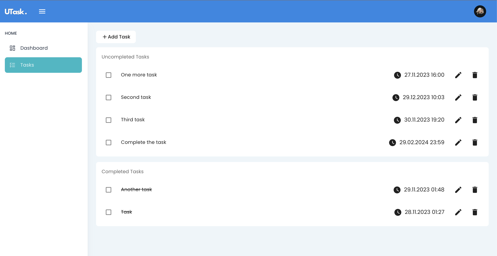

# UTask
Веб-приложение для управления задачами: создание, редактирование, отслеживание выполнения задач.



## Стэк технологий
* Node.js
* Express.js
* MongoDB
* Nuxt.js

## Требования
Перед запуском убедитесь, что у вас установлен и запущен Docker, а также Node.js

## Установка
1. Клонирование репозитория:
```git clone https://github.com/greenfest/task-api.git```
2. Установка зависимостей:
```yarn install```
2. Запуск приложения из корневой папки (запускаются серверная и клиентская часть, с использованием concurrently):
```yarn run dev```